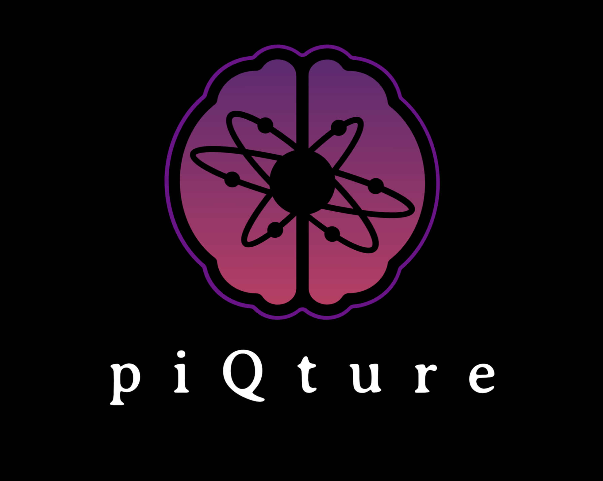

# _**piQture**_: QML Library for Image Processing

 <p align="center">
     
 </p>

[](https://github.com/SaashaJoshi/piQture/blob/main/LICENSE)
[](https://github.com/SaashaJoshi/piQture/blob/main/piqture/version.txt)
[](https://coveralls.io/github/SaashaJoshi/piQture?branch=main)
[](https://doi.org/10.5281/zenodo.13625704)

_**piQture**_ is an open-source Python toolkit designed to simplify the development, execution, and training of Quantum Machine Learning (QML) models tailored for image processing tasks. This library seamlessly integrates with the Qiskit SDK, providing a convenient and user-friendly workflow for leveraging the potential of quantum computing for advanced image processing.


## Getting Started

### Setup


Begin by creating a new Python environment or activating an existing one for working with the `piQture` library. You set up a Python virtual environment `venv` or a Conda environment and use `pip` or `conda` to install the `piQture` package.

Here's how you can create a conda environment and manage a Python environment:

```bash
# Create a new conda environment
conda create -n piqture_env python=3.x

# Activate the conda environment
conda activate piqture_env
```

### Installation

Once the Python environment is activated, the required `piQture` package can be installed using `pip`. You can install the latest version directly from PyPI.

```bash
pip install piqture
```

To create a development environment, and install `piQture` from source, you can refer to section `Installation from Source`.


### Installation from Source

To set up a development environment and install `piQture` from source, follow these steps:

1. Start by cloning the `piQture` repository from GitHub.

```bash
# Clone the GitHub repository.
git clone https://github.com/SaashaJoshi/piQture.git
```

2. Activate the Python environment and navigate to the `piQture` repository directory. Then, inside the Python environment, install the required dependencies from the `requirements.txt` configuration file.

```bash
# Install the required dependencies
pip install -r requirements.txt
```

3. Install `piQture` in editable mode to make changes to the source code.

```bash
# Install from source in editable mode
pip install -e .
```

Your development environment is set up, and `piQture` is installed from source. You can now start making changes to the code, running tests, and contributing to the project as a developer.


### First program with _piQture_

Let's build a Quantum Image Representation with the `Improved Novel Enhanced Quantum Representation (INEQR)` encoding method.

```python
# INEQR Encoding Method
import math
import torch.utils.data
import torchvision.transforms.functional as F
from piqture.data_loader.mnist_data_loader import load_mnist_dataset
from piqture.transforms import MinMaxNormalization

train_loader, test_loader = load_mnist_dataset(load="both", batch_size_train=64, batch_size_test=1000)
# OR
train_loader = load_mnist_dataset(load="train", batch_size_train=64)
test_loader = load_mnist_dataset(load="test", batch_size_test=1000)

# Iterate through the train_loader to retrieve a batch of images and labels
for image_batch, label_batch in train_loader:
    # Assuming you want to retrieve the first batch only
    image, label = image_batch[0], label_batch[0]

    # Get the original image size
    height, width = image.squeeze().size()

    # Resize image to the nearest power of 2 (e.g., 32x32)
    new_height = 2 ** math.ceil(math.log2(height))
    new_width = 2 ** math.ceil(math.log2(width))

    # Resize image using torchvision's functional transforms
    image_resized = F.resize(image, (new_height, new_width))

    # Update image size after resizing
    image_size = tuple(image_resized.squeeze().size())

    # Break after processing the first batch
    break

# Apply MinMaxNormalization on the resized image data (normalize pixel values between 0 and 1)
normalizer = MinMaxNormalization(normalize_min=0, normalize_max=1)
image_normalized = normalizer(image_resized)

# Change pixel values from float to integer
pixel_vals = (image_normalized * 255).round().to(torch.uint8)
pixel_vals = pixel_vals.tolist()

embedding = INEQR(image_size, pixel_vals).ineqr()

# Display circuit.
embedding.draw()
```

### Further examples

Let's build a Quantum Convolutional Neural Network (QCNN) with Convolutional, Pooling, and Fully-Connected layers.

```python
from piqture.neural_networks.layers import (
    QuantumConvolutionalLayer,
    QuantumPoolingLayer2,
    FullyConnectedLayer,
)
from piqture.neural_networks import QCNN

# Initializing a QCNN circuit with given image dimensions.
image_dims = 4
qcnn_circuit = QCNN(image_dims)

# Gathering parameters for layer objects.
mera_params = {"layer_depth": 1, "mera_instance": 0, "complex_structure": False}
convolutional_params = {"mera_args": mera_params}

# Build QCNN circuit.
qcnn_circuit = qcnn_circuit.sequence(
    [
        (QuantumConvolutionalLayer, convolutional_params),
        (QuantumPoolingLayer2, {}),
        (FullyConnectedLayer, {})
    ]
)

# Display circuit.
qcnn_circuit.draw()
```


## Contribution Guidelines

We welcome contributions! Whether you're a quantum enthusiast or a Python developer, your input is valuable. Check out our Contribution Guidelines to get started.

## Authors and Citation

Saasha Joshi

## License

This project is licensed under the Apache License - see the [LICENSE](https://github.com/SaashaJoshi/quantum-image-processing/blob/main/LICENSE) file for details.

## Acknowledgments
